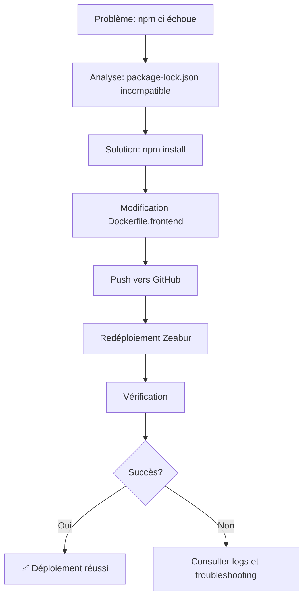

# 📑 Index - Correction Frontend Zeabur - 20 Avril 2026

## 🎯 Objectif
Corriger l'erreur de build du frontend sur Zeabur causée par `npm ci` et déployer avec succès l'application complète.

---

## 📂 Structure des Fichiers

### 🚀 Fichiers d'Action Immédiate

| Fichier | Description | Priorité |
|---------|-------------|----------|
| **00_LIRE_MAINTENANT_CORRECTION_FRONTEND.txt** | Guide principal - À lire en premier | ⭐⭐⭐ |
| **QUICK_FIX_FRONTEND_ZEABUR.txt** | Guide rapide en 3 étapes | ⭐⭐⭐ |
| **Doc zeabur docker/Scripts/push-to-github-zeabur.ps1** | Script de push automatique | ⭐⭐⭐ |

### 📖 Documentation Détaillée

| Fichier | Description | Usage |
|---------|-------------|-------|
| **00_CORRECTION_FRONTEND_ZEABUR_20_AVRIL_2026.txt** | Explication complète du problème et solution | Référence |
| **VERIFICATION_DEPLOIEMENT_ZEABUR.md** | Checklist de vérification post-déploiement | Après déploiement |
| **Doc zeabur docker/03_GUIDE_DEPLOIEMENT_ZEABUR_SANS_BUILD_LOCAL.md** | Guide complet Zeabur | Référence complète |

### 🔧 Fichiers Techniques Modifiés

| Fichier | Modification | Impact |
|---------|--------------|--------|
| **Dockerfile.frontend** | `npm ci` → `npm install --production=false` | ✅ Corrige le build |
| **docker-compose.yml** | Configuration services | Inchangé |
| **py_backend/Dockerfile** | Configuration backend | Inchangé |

---

## 🔄 Workflow de Correction



---

## 📊 État Actuel des Services

### Backend ✅
- **Statut:** Déployé et fonctionnel
- **URL:** https://pybackend.zeabur.app
- **Port:** 8080
- **Health:** OK
- **Logs:** Aucune erreur

### Frontend ⏳
- **Statut:** Correction appliquée, en attente de redéploiement
- **URL:** https://prclaravi.zeabur.app (sera accessible après redéploiement)
- **Port:** 80
- **Modification:** npm install au lieu de npm ci

---

## 🎯 Plan d'Action

### Étape 1: Push vers GitHub (2 minutes)
```powershell
.\Doc zeabur docker\Scripts\push-to-github-zeabur.ps1
```

**Ce que fait le script:**
- ✅ Vérifie les fichiers requis
- ✅ Crée un commit descriptif
- ✅ Push vers GitHub
- ✅ Affiche les prochaines étapes

### Étape 2: Redéploiement Zeabur (5-10 minutes)
1. Aller sur https://zeabur.com/dashboard
2. Sélectionner projet "claraverse-production"
3. Service "frontend" → Bouton "Redeploy"
4. Attendre le build complet

### Étape 3: Vérification (1 minute)
1. Ouvrir https://prclaravi.zeabur.app
2. Vérifier le chargement
3. Tester le menu "Démarrer"
4. Vérifier la console (F12)

---

## 🔍 Détails Techniques

### Problème Original
```dockerfile
# ❌ Échouait
RUN npm ci --only=production
```

**Erreur:**
```
npm error npm-shrinkwrap.json with lockfileVersion >= 1
npm error Run an install with npm@5 or later to generate a package-lock.json
```

### Solution Appliquée
```dockerfile
# ✅ Fonctionne
RUN npm install --production=false
```

**Pourquoi ça fonctionne:**
- `npm install` est plus tolérant
- Fonctionne avec ou sans package-lock.json
- `--production=false` installe toutes les dépendances (nécessaire pour build)
- Crée/met à jour package-lock.json automatiquement

---

## 📋 Checklist de Vérification

### Avant Déploiement
- [x] Dockerfile.frontend modifié
- [x] Script de push préparé
- [x] Documentation créée
- [ ] Push vers GitHub effectué

### Après Déploiement
- [ ] Frontend accessible
- [ ] Backend accessible
- [ ] Communication frontend ↔ backend OK
- [ ] Menu Démarrer fonctionnel
- [ ] Pas d'erreur console
- [ ] Tests fonctionnels passent

---

## 🚨 Troubleshooting

### Si le build échoue encore

1. **Vérifier les logs Zeabur**
   - Dashboard → Service frontend → Logs
   - Chercher l'erreur exacte

2. **Vérifier package.json**
   ```bash
   cat package.json
   ```
   - Toutes les dépendances présentes?
   - Versions compatibles?

3. **Vérifier Dockerfile.frontend**
   ```bash
   cat Dockerfile.frontend | grep "npm install"
   ```
   - Doit afficher: `RUN npm install --production=false`

### Si le frontend ne charge pas

1. **Vérifier le statut du service**
   - Dashboard Zeabur → Service frontend
   - Doit être "Running" (vert)

2. **Vérifier les logs runtime**
   - Chercher les erreurs Nginx
   - Vérifier que le port 80 est exposé

3. **Tester le health check**
   ```bash
   curl https://prclaravi.zeabur.app/health
   ```

### Si erreur CORS

1. **Vérifier docker-compose.yml**
   ```yaml
   CORS_ORIGINS=https://prclaravi.zeabur.app
   ```

2. **Vérifier les variables d'environnement frontend**
   ```yaml
   VITE_BACKEND_URL=https://pybackend.zeabur.app
   ```

3. **Redéployer les deux services**

---

## 📚 Ressources Supplémentaires

### Documentation Zeabur
- [Guide officiel Docker Compose](https://zeabur.com/docs/deploy/docker-compose)
- [Configuration des domaines](https://zeabur.com/docs/deploy/domain)
- [Variables d'environnement](https://zeabur.com/docs/deploy/variables)

### Documentation Projet
- `Doc zeabur docker/00_DEPLOIEMENT_SANS_BUILD_LOCAL.txt`
- `Doc zeabur docker/02_SOLUTION_DOCKER_COMPOSE_ZEABUR.md`
- `Doc zeabur docker/04_GUIDE_IMPLEMENTATION.md`

### Scripts Utiles
- `Doc zeabur docker/Scripts/test-docker-local.ps1` - Test local
- `Doc zeabur docker/Scripts/create-docker-compose.ps1` - Création config
- `Doc zeabur docker/Scripts/verifier-config-zeabur.ps1` - Vérification

---

## 🎉 Résultat Attendu

Après avoir suivi toutes les étapes:

✅ **Frontend**
- Accessible sur https://prclaravi.zeabur.app
- Interface complète chargée
- Menu Démarrer fonctionnel
- Tous les modes disponibles

✅ **Backend**
- Accessible sur https://pybackend.zeabur.app
- API fonctionnelle
- Health check OK
- Logs sans erreur

✅ **Communication**
- Frontend ↔ Backend OK
- CORS configuré correctement
- Requêtes API réussies
- Temps de réponse < 5s

✅ **Déploiement Automatique**
- Push GitHub → Build automatique
- Déploiement sans intervention
- Rollback possible si nécessaire

---

## 📞 Support

### En cas de problème persistant

1. **Consulter les logs**
   - Zeabur Dashboard → Logs
   - Console navigateur (F12)

2. **Vérifier la documentation**
   - Fichiers dans `Doc zeabur docker/`
   - Ce fichier index

3. **Vérifier la configuration**
   - docker-compose.yml
   - Dockerfile.frontend
   - py_backend/Dockerfile

4. **Tester localement**
   ```bash
   docker-compose up --build
   ```

---

## 🔗 Liens Rapides

| Service | URL | Statut |
|---------|-----|--------|
| Frontend | https://prclaravi.zeabur.app | ⏳ En attente |
| Backend | https://pybackend.zeabur.app | ✅ Fonctionnel |
| Dashboard | https://zeabur.com/dashboard | - |
| GitHub | https://github.com/ohadasave/Claraverse_windows_v_11_20_04_2026_v5_docker_zeabur_t1 | - |

---

## 📝 Historique des Modifications

| Date | Modification | Fichier | Raison |
|------|--------------|---------|--------|
| 20/04/2026 | npm ci → npm install | Dockerfile.frontend | Erreur build package-lock.json |
| 20/04/2026 | Mise à jour commit message | push-to-github-zeabur.ps1 | Refléter la correction |
| 20/04/2026 | Création documentation | Multiples fichiers | Guider le déploiement |

---

## ✅ Prochaines Étapes

1. **Immédiat:** Exécuter le script de push
2. **Court terme:** Redéployer sur Zeabur
3. **Moyen terme:** Vérifier et tester
4. **Long terme:** Monitoring et maintenance

---

**Dernière mise à jour:** 20 Avril 2026
**Version:** 1.0
**Statut:** Prêt pour déploiement
