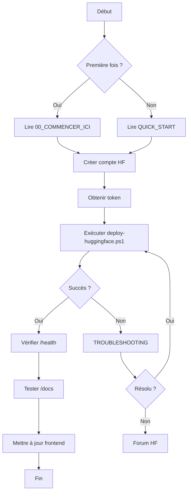

# 📚 Index Complet : Déploiement Hugging Face Spaces

## 🎯 Vue d'ensemble du Projet

**Objectif** : Déployer le backend Python Claraverse sur Hugging Face Spaces via Docker

**Statut** : Documentation complète créée ✅

**Date** : 18 Avril 2026

---

## 📂 Structure Complète de la Documentation

```
Doc Hugging Face deploy/
│
├── 📄 README.md                              # Index principal et vue d'ensemble
├── 📄 00_INDEX_COMPLET.md                    # Ce fichier (navigation complète)
│
├── 🚀 GUIDES DE DÉMARRAGE
│   ├── 00_COMMENCER_ICI_HUGGINGFACE.txt     # Guide complet étape par étape
│   ├── QUICK_START_HUGGINGFACE.txt          # Démarrage rapide (5 minutes)
│   └── GUIDE_DEPLOIEMENT_HUGGINGFACE.md     # Guide détaillé avec explications
│
├── 🔧 OUTILS ET SCRIPTS
│   ├── deploy-huggingface.ps1               # Script de déploiement automatique
│   └── COMMANDES_RAPIDES.txt                # Commandes à copier-coller
│
└── 🆘 SUPPORT
    └── TROUBLESHOOTING_HUGGINGFACE.md       # Guide de dépannage complet
```

---

## 🗺️ Parcours Recommandés

### 🎓 Pour les Débutants Complets

```
1. Lire : 00_COMMENCER_ICI_HUGGINGFACE.txt
   └─> Comprendre le processus complet
   
2. Préparer : Créer compte HF + obtenir token
   └─> https://huggingface.co/join
   └─> https://huggingface.co/settings/tokens
   
3. Exécuter : deploy-huggingface.ps1
   └─> Suivre les instructions à l'écran
   
4. Vérifier : Tester l'API déployée
   └─> https://[username]-claraverse-backend.hf.space/health
   
5. En cas de problème : TROUBLESHOOTING_HUGGINGFACE.md
```

### ⚡ Pour les Utilisateurs Pressés

```
1. Lire : QUICK_START_HUGGINGFACE.txt (2 min)
2. Exécuter : deploy-huggingface.ps1
3. Attendre : Build sur Hugging Face (5-10 min)
4. Tester : /health et /docs
```

### 🔍 Pour les Utilisateurs Avancés

```
1. Consulter : GUIDE_DEPLOIEMENT_HUGGINGFACE.md
2. Personnaliser : Dockerfile, requirements.txt
3. Déployer : Commandes manuelles (COMMANDES_RAPIDES.txt)
4. Optimiser : Configuration avancée
```

---

## 📖 Description Détaillée des Fichiers

### 📄 README.md
**Type** : Documentation principale  
**Contenu** :
- Vue d'ensemble du projet
- Structure de la documentation
- Liens vers tous les guides
- Processus de déploiement illustré
- Résultats attendus

**Quand l'utiliser** : Point d'entrée principal

---

### 📄 00_COMMENCER_ICI_HUGGINGFACE.txt
**Type** : Guide complet pour débutants  
**Durée** : 15-20 minutes de lecture  
**Contenu** :
- ✅ Étape 1 : Prérequis détaillés
- ✅ Étape 2 : Préparation du projet
- ✅ Étape 3 : Création du Space
- ✅ Étape 4 : Configuration des fichiers
- ✅ Étape 5 : Déploiement (2 méthodes)
- ✅ Étape 6 : Vérification et tests
- ✅ Étape 7 : Dépannage de base

**Quand l'utiliser** : Première utilisation, besoin de comprendre chaque étape

---

### 📄 QUICK_START_HUGGINGFACE.txt
**Type** : Guide rapide  
**Durée** : 5 minutes  
**Contenu** :
- 5 étapes essentielles
- Commandes à copier-coller
- Vérification rapide
- Dépannage express

**Quand l'utiliser** : Déploiement rapide, utilisateur expérimenté

---

### 📄 GUIDE_DEPLOIEMENT_HUGGINGFACE.md
**Type** : Documentation technique complète  
**Durée** : 30+ minutes  
**Contenu** :
- Configuration détaillée (port, Dockerfile, README)
- Processus de déploiement complet
- Méthodes alternatives
- Configuration avancée (variables d'env, CI/CD)
- Optimisation et sécurité
- Monitoring et logs
- Coûts et tiers payants

**Quand l'utiliser** : Configuration personnalisée, compréhension approfondie

---

### 📄 deploy-huggingface.ps1
**Type** : Script PowerShell automatique  
**Durée** : 2-5 minutes d'exécution  
**Fonctionnalités** :
- ✅ Vérifications préliminaires automatiques
- ✅ Création du README.md pour HF
- ✅ Configuration Git automatique
- ✅ Validation du Dockerfile
- ✅ Déploiement en un clic
- ✅ Affichage des URLs et prochaines étapes

**Paramètres** :
```powershell
.\deploy-huggingface.ps1 -SpaceName "claraverse-backend" -Username "votre-username" -Token "votre-token"
```

**Quand l'utiliser** : Déploiement automatisé, gain de temps

---

### 📄 COMMANDES_RAPIDES.txt
**Type** : Référence rapide  
**Contenu** :
- Commandes de déploiement automatique
- Commandes de déploiement manuel
- Commandes de mise à jour
- Commandes de vérification
- Commandes Docker locales
- Commandes de monitoring
- Templates de commit
- URLs importantes

**Quand l'utiliser** : Besoin de copier-coller des commandes rapidement

---

### 📄 TROUBLESHOOTING_HUGGINGFACE.md
**Type** : Guide de dépannage exhaustif  
**Contenu** :
- 🏗️ Problèmes de build (6 cas)
- 🚀 Problèmes de démarrage (3 cas)
- ⚡ Problèmes de performance (3 cas)
- 🔌 Problèmes de connexion (3 cas)
- 🔀 Problèmes Git (4 cas)
- ⚠️ Erreurs courantes (4 cas)
- 🆘 Obtenir de l'aide
- ✅ Checklist de vérification

**Quand l'utiliser** : En cas d'erreur, problème de déploiement

---

## 🎯 Cas d'Usage Spécifiques

### Cas 1 : Premier Déploiement
```
1. 00_COMMENCER_ICI_HUGGINGFACE.txt
2. deploy-huggingface.ps1
3. Vérifier sur HF
```

### Cas 2 : Mise à Jour du Backend
```
1. Modifier les fichiers
2. COMMANDES_RAPIDES.txt → Section "Mise à jour"
3. git add . && git commit -m "..." && git push hf main
```

### Cas 3 : Erreur de Build
```
1. TROUBLESHOOTING_HUGGINGFACE.md → "Problèmes de build"
2. Vérifier les logs sur HF
3. Appliquer la solution
4. Redéployer
```

### Cas 4 : Configuration Personnalisée
```
1. GUIDE_DEPLOIEMENT_HUGGINGFACE.md → "Configuration Avancée"
2. Modifier Dockerfile/requirements.txt
3. Tester localement avec Docker
4. Déployer
```

### Cas 5 : Optimisation des Performances
```
1. GUIDE_DEPLOIEMENT_HUGGINGFACE.md → "Optimisation"
2. TROUBLESHOOTING_HUGGINGFACE.md → "Problèmes de performance"
3. Upgrader le hardware si nécessaire
```

---

## 🔄 Workflow Complet



---

## 📊 Matrice de Décision

| Situation | Fichier à Consulter | Temps Estimé |
|-----------|---------------------|--------------|
| Je débute complètement | 00_COMMENCER_ICI_HUGGINGFACE.txt | 20 min |
| Je veux déployer vite | QUICK_START_HUGGINGFACE.txt | 5 min |
| Je veux comprendre en détail | GUIDE_DEPLOIEMENT_HUGGINGFACE.md | 30 min |
| J'ai une erreur | TROUBLESHOOTING_HUGGINGFACE.md | Variable |
| Je veux automatiser | deploy-huggingface.ps1 | 2 min |
| Je cherche une commande | COMMANDES_RAPIDES.txt | 1 min |

---

## ✅ Checklist Complète

### Avant le Déploiement
- [ ] Compte Hugging Face créé
- [ ] Token HF obtenu (Write access)
- [ ] Git installé et configuré
- [ ] Projet Claraverse cloné
- [ ] Documentation lue

### Pendant le Déploiement
- [ ] Space créé sur HF
- [ ] README.md créé
- [ ] .dockerignore configuré
- [ ] Dockerfile vérifié (port 7860)
- [ ] Git initialisé
- [ ] Remote HF ajouté
- [ ] Fichiers commités
- [ ] Push vers HF réussi

### Après le Déploiement
- [ ] Build terminé (statut "Running")
- [ ] /health retourne 200 OK
- [ ] /docs accessible
- [ ] API testée avec curl
- [ ] Frontend mis à jour
- [ ] Documentation consultée

---

## 🎓 Ressources Complémentaires

### Documentation Officielle
- [Hugging Face Spaces](https://huggingface.co/docs/hub/spaces)
- [Docker Spaces SDK](https://huggingface.co/docs/hub/spaces-sdks-docker)
- [FastAPI Documentation](https://fastapi.tiangolo.com/)

### Communauté
- [Forum Hugging Face](https://discuss.huggingface.co/)
- [Discord Hugging Face](https://discord.gg/hugging-face)
- [GitHub Discussions](https://github.com/huggingface/hub-docs/discussions)

### Outils
- [Git Documentation](https://git-scm.com/doc)
- [Docker Documentation](https://docs.docker.com/)
- [PowerShell Documentation](https://docs.microsoft.com/powershell/)

---

## 💡 Conseils Généraux

### Pour Réussir
1. ✅ Lire la documentation avant de commencer
2. ✅ Tester localement avec Docker d'abord
3. ✅ Utiliser le script automatique pour gagner du temps
4. ✅ Consulter les logs en cas de problème
5. ✅ Demander de l'aide sur le forum si bloqué

### À Éviter
1. ❌ Commiter des secrets (API keys, tokens)
2. ❌ Ignorer les erreurs de build
3. ❌ Déployer sans tester localement
4. ❌ Utiliser des fichiers volumineux (>10MB)
5. ❌ Oublier de mettre à jour le frontend

---

## 📞 Support et Contact

### En Cas de Problème
1. **Consulter** : TROUBLESHOOTING_HUGGINGFACE.md
2. **Vérifier** : Logs sur Hugging Face
3. **Tester** : Localement avec Docker
4. **Demander** : Forum Hugging Face

### Signaler un Bug
- Repository : [Lien vers votre repo]
- Issues : [Lien vers les issues]
- Email : [Votre email de support]

---

## 🎉 Félicitations !

Si vous avez suivi cette documentation, vous devriez maintenant avoir :

✅ Une compréhension complète du processus de déploiement  
✅ Un backend déployé sur Hugging Face Spaces  
✅ Une API accessible publiquement  
✅ Les outils pour maintenir et mettre à jour votre déploiement  

**Prochaines étapes** :
1. Intégrer l'API dans votre frontend
2. Configurer les variables d'environnement
3. Monitorer les performances
4. Optimiser si nécessaire

---

**Dernière mise à jour** : 18 Avril 2026  
**Version** : 1.0.0  
**Auteur** : Équipe Claraverse
